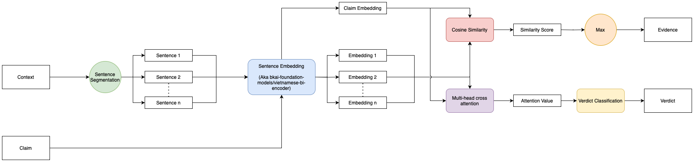

## Requirements

```bash
pip install -r requirements.txt
```

## Split datasets

- Run the command below to split train datasets and dev datasets.

```bash
cd NLP_UIT
python utils/split_file.py {data_source_path} {save_path}
```

# Model

Select type model:
1. Bi encoder with multi-head cross attention
2.
3.


## Bi encoder with multi-head cross attention



```bash
cd NLP_UIT
python main.py {type_model}
```

